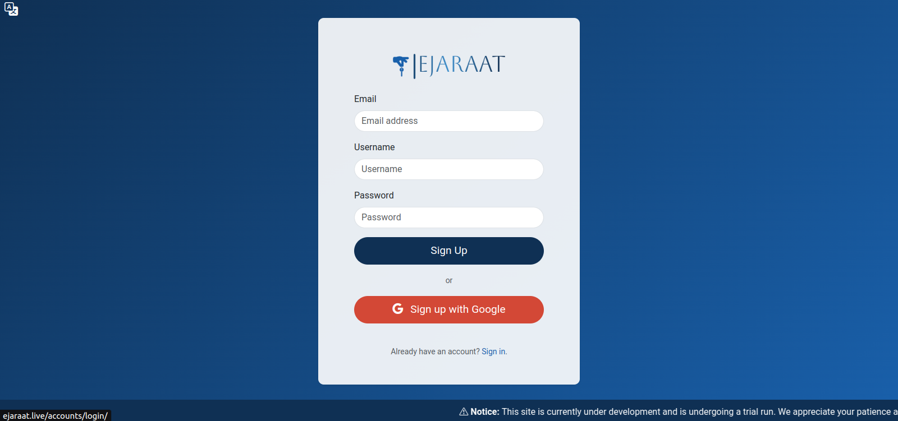
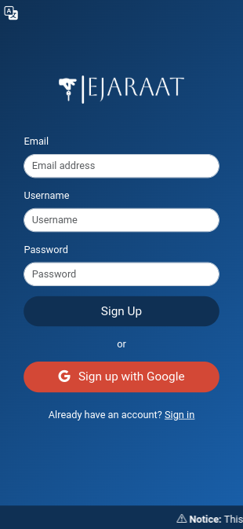
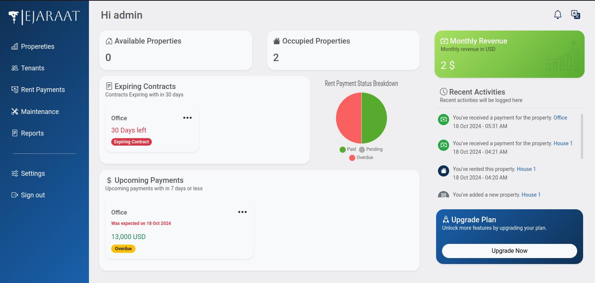
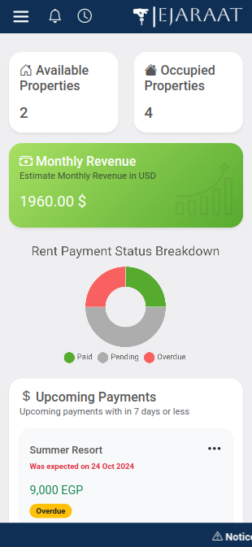

# Ejaraat: Simplifying Property Management

Ejaraat is an innovative web application tailored for property owners seeking to streamline and simplify the management of their properties. Whether you own a single property or manage an extensive portfolio, Ejaraat offers a comprehensive suite of tools to help you efficiently oversee your assets.

## Key Features
- **Scalable Property Management**: Manage properties of any size, from individual units to large portfolios.
- **User-Friendly Interface**: Designed for ease of use, ensuring property owners can navigate and manage their assets effortlessly.
- **Comprehensive Tools**: Track rentals, manage tenant information, and monitor property performance all in one place.
- **Multilingual**: Full support for English and Arabic.

## Project Purpose
Ejaraat addresses the need for a centralized platform that simplifies property management. The platform is designed to help landlords reduce manual work, gain valuable insights into property performance, and streamline tenant communication.

## Major Functions
1. Add and manage properties.
2. Track tenant details, rental payments, and lease agreements.
3. Monitor property performance with visual reports and insights.
4. Provide a secure portal for landlords to access all property data in one place.

## Dependencies
- **Django**: Full stack framework.
- **PostgreSQL**: Database for storing application data.
- **Bootstrap**: Frontend framework for UI design.
- **Python 3.10**: Core language.

## Build Instructions
### Prerequisites:
- Python 3.x installed.
- Virtual environment setup (optional but recommended).
- PostgreSQL installed and configured.

### Local Setup:
1. Clone the repository:
   ```bash
   git clone https://github.com/AlWaleedMusa/Ejaraat.git
   ```
2. Navigate to the project directory:
   ```bash
   cd Ejaraat
   ```
3. Install dependencies:
   ```bash
   pip install -r requirements.txt
   ```
4. Configure environment variables in a `.env` file:
   ```env
    # General
    SECRET_KEY = 'django_secret_key'
    DJANGO_ALLOWED_HOSTS = 'localhost,127.0.0.1'
    DEBUG = "True"

    # External API
    CURRENCY_CONVERTER_API = "currency_converter_key"

    # Email
    EMAIL_HOST_USER = "gmail"
    EMAIL_HOST_PASSWORD = "gmail_app_password"

    # Database
    DATABASE_NAME = 'db_name'
    DATABASE_USER = 'db_user'
    DATABASE_PASSWORD = "db_password"
    DATABASE_HOST = 'db_host'
   ```
5. Run database migrations:
   ```bash
   python manage.py migrate
   ```
6. Start the development server:
   ```bash
   python manage.py runserver
   ```

## Project URL
Live version of the application: [Visit Ejaraat](http://ejaraat.live)


## Future Improvements
- Integration with payment gateways for seamless rent collection.
- Implementation of a tenant communication system.

## Screenshots









## License
This project is licensed under the MIT License - see the LICENSE file for details.

Feel free to check it out and experience the future of property management!

